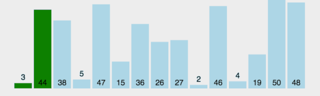
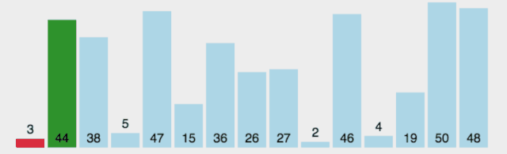
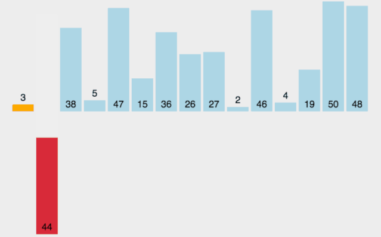

1.  冒泡排序
    最经典的排序算法。
    以从小到大排序为例：
    a.比较相邻元素，如果第一个比第二个大，就交换二者。
    b.这样在最后的应该是最大的数
    c.依次重复
    ```
    void maopao(int *nums, int numsSize){
        int i, j;
        int tmp;
        for(i=0;i<numsSize-1;i++){// 为什么是numsSize-1
            for(j=0;j<numsSize-1-i;j++){
                if(nums[j]>nums[j+1]){// 比较的是j和j+1
                    tmp=nums[j];
                    nums[j]=nums[j+1];
                    nums[j+1]=tmp;
                }
            }
        }
    }
    ```
    优化点：用一个flag标记是否进行了swap，如果没有说明已经结束了
        
    平均时间复杂度：O(n²)   
    最坏时间复杂度：O(n²)   
    最优时间复杂度：O(n)   
    空间复杂度：    O(1)   
    稳定性：        稳定   

2.  选择排序
    最稳定的排序，无论什么数据都是O(n²)时间复杂度
    a.选一个最小的放第一个
    b.选一个最小的放第二个
    ...
    ```
    void selectSort(int *nums, int numsSize){
        int i, j, min, tmp;
        for(i=0;i<numsSize-1;i++){
            min=i;
            for(j=i+1;j<numsSize;j++){
                if(nums[j]<nums[min]){
                    min=j;
                }
            }
            tmp=nums[min];
            nums[min]=nums[i];
            nums[i]=tmp;
        }
    }
    ```
        
    平均时间复杂度：O(n²)   
    最坏时间复杂度：O(n²)   
    最优时间复杂度：O(n²)   
    空间复杂度：    O(1)   
    稳定性：        不稳定   

    为什么不稳定：
    选择排序是给每个位置选择当前元素最小的，比如给第一个位置选择最小的，在剩余元素里面给第二个元素选择第二小的，依次类推，直到第n-1个元素，第n个元素不用选择了，因为只剩下它一个最大的元素了。那么，在一趟选择，如果一个元素比当前元素小，而该小的元素又出现在一个和当前元素相等的元素后面，那么交换后稳定性就被破坏了。举个例子，序列5 8 5 2 9，我们知道第一遍选择第1个元素5会和2交换，那么原序列中两个5的相对前后顺序就被破坏了，所以选择排序是一个不稳定的排序算法。

3.  希尔排序
    是插入排序的一种，他是针对于插入排序算法的改进

    ```
    void shellSort(int *nums, int numsSize){
        int i, j, gap, tmp;
        for (gap = numsSize >> 1; gap > 0; gap >>= 1){
            for (i = gap; i < numsSize; i++){
                tmp = nums[i];
                for (j = i - gap; j >= 0 && nums[j] > tmp; j -= gap){
                    nums[j + gap] = nums[j];
                }
                nums[j + gap] = tmp;
            }
        }
    }
    ```

4.  插入排序
    从第一个元素开始，该元素可以认为已经被排序；
    取出下一个元素，在已经排序的元素序列中从后向前扫描；
    如果该元素（已排序）大于新元素，将该元素移到下一位置；
    重复步骤3，直到找到已排序的元素小于或者等于新元素的位置；
    将新元素插入到该位置后；
    重复步骤2~5。
    ```
    void insertSort(int *nums, int numsSize){
        int i, j, tmp, key;
        for(i=1;i<numsSize;i++){
            key=nums[i];
            j=i-1;
            while(j>=0&&nums[j]>key){
                nums[j+1]=nums[j];
                j=j-1;
            }
            nums[j+1]=key;
        }
    }
    ```
        
    平均时间复杂度：O(n²)   
    最坏时间复杂度：O(n²)   
    最优时间复杂度：O(n)   
    空间复杂度：    O(1)   
    稳定性：        稳定 

5.  归并排序
    分治法、递归
    将两个有序表合并为一个有序表，称为2路归并。
    和选择排序一样，性能不受输入数据的影响，始终是O(nlogn)的时间复杂度,**代价是需要额外的内存空间**
    


