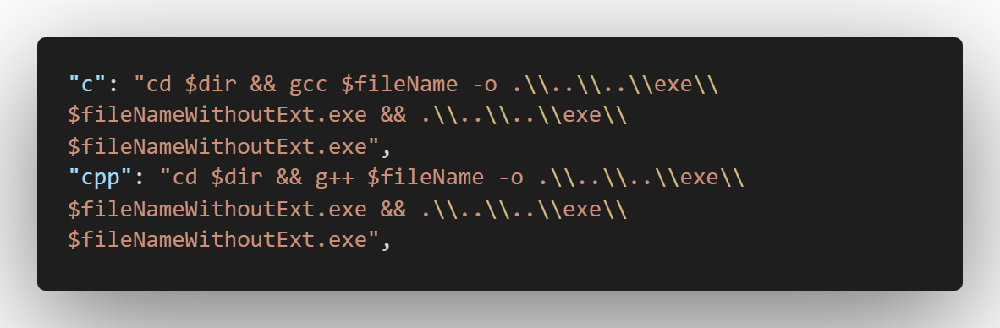

# 怎么改exe地址

> 为了GitHub同步代码时不同步生成的exe文件，需要把exe文件生成到当前项目以外的文件夹中。
>

这里做一次记录，以防之后还要再找

> 用于以下情况：
>
> 1、换新电脑进行重新配置C语言环境以及使用git
>
> 2、有人向我pr，请不要带exe文件
>
> 有网可以看详细过程：
>
> 1、code runner
>
> https://dhexx.cn/news/show-1073353.html#google_vignette
>
> 2、F5调试
>
> https://blog.csdn.net/weixin_45847957/article/details/129132323

### 1、code runner

Code Runner -> 扩展设置 -> Executor Map -> settings.json ->



注意需要提前在指定位置创建好指定名称的文件夹

### 2、F5调试

更改task.json和launch.json两个文件，具体操作如下所示：

修改task.json文件


修改launch.json文件

```
"program": "${fileDirname}\\${fileBasenameNoExtension}.exe",
改为
"program": "${fileDirname}\\..\\..\\exe\\${fileBasenameNoExtension}.exe",
```

> 引用来源：
>
> 版权声明：本文为CSDN博主「minghangCao」的原创文章，遵循CC 4.0 BY-SA版权协议，转载请附上原文出处链接及本声明。
> 原文链接：https://blog.csdn.net/weixin_45847957/article/details/129132323
